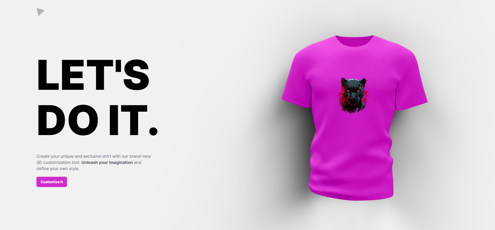

<!-- Banner Section -->

# 🛠️ Three.JS 3D AI Web Design

<!--  -->

<div align="center" >
<!-- link to project -->
    <a href='-URL TO DEMO GOES HERE-'>
    <!-- link to local image -->
        
    </a>

**Link to project:** http://recruiters-love-seeing-live-demos.com/
<br>
<br>

<p>
<a href="-REPOSITORY URL GOES HERE-" target="_blank">

</a>
<a href="-URL DEMO GOES HERE-" target="_blank">

</a>
</p>

</div>

Write a short sentence or two about this project and what it does. Be sure to include a link and a screenshot (we're front end devs so we can actually see our work!)..

Write a short sentence or two about this project and what it does. Be sure to include a link and a screenshot (we're front end devs so we can actually see our work!)..

<br>
<br>

## How It's Made:<br>

<br>

## Scaffolding Your First Vite Project with React

```terminal
 > npm create vite@latest -- --template react client
 > cd my-project (client)
```

## Installing Your Packages

```terminal
  > npm install three @react-three/fiber @react-three/drei maath valtio react-color framer-motion
```

- [Three JS 3d Library](https://threejs.org/docs/index.html#manual/en/buildTools/Testing-with-NPM)
  - [React-Three Fiber a react renderer]()
  - [React Three Drei useful addons]()
  - [Maath math helpers]()
  - [Valtio manage react state]()
  - [React color picker]()
  - [Framer for animations]()

## Install Tailwind CSS

> Install tailwindcss and its peer dependencies, then generate your tailwind.config.js and postcss.config.js files.

```terminal
 > npm install -D tailwindcss postcss autoprefixer
 > npx tailwindcss init -p
```

## Configure your template paths

> Add the paths to all of your template files in your tailwind.config.js file.

```terminal
 /** @type {import('tailwindcss').Config} */
export default {
  content: [
    "./index.html",
    "./src/**/*.{js,ts,jsx,tsx}",
  ],
  theme: {
    extend: {},
  },
  plugins: [],
}
```

<br>
<br>

## Add the Tailwind directives to your CSS

> Add the @tailwind directives for each of Tailwind’s layers to your ./src/index.css file.

```terminal
>  @tailwind base;
>  @tailwind components;
>  @tailwind utilities;
```

<br>
<br>

- [JS Mastery ](https://youtu.be/ZqEa8fTxypQ)
- [FREE Ultimate ThreeJS Cheatsheet:](https://resource.jsmastery.pro/threejs-cheatsheet)
- [⭐Hostinger (2.99 month w/2months free):](https://www.hostinger.com/recommended/javascript-mastery?utm_medium=affiliate&utm_source=aff72940&utm_campaign=476&session=102f35345e5d2ed8517b64f609349e)
- [GitHub Code (give it a star ⭐)](https://github.com/adrianhajdin/project_threejs_ai)
- [GitHub Gist Code Snippets](https://gist.github.com/adrianhajdin/597252d9d77fa65e30f596d99b03cc11)
- [Assets, Components, Public folders](https://drive.google.com/drive/folders/166wA5NsMV_5D8NN7ujDDbPXC1X65vf2I)

> [@AndersonMancini ](https://www.youtube.com/channel/UCEZqgdPDnbpX9Ihbw_k4VUA)
>
> ThreeJS Creator
>
> - [💡 Blender 3D model course on Udemy](https://www.udemy.com/course/react-three-fiber-configurator/)

<br>
<br>
Here's where you can go to town on how you actually built this thing. Write as much as you can here, it's totally fine if it's not too much just make sure you write _something_. If you don't have too much experience on your resume working on the front end that's totally fine. This is where you can really show off your passion and make up for that ten fold.
<br>

<p align="center">
  <a href="https://skillicons.dev">
    
  </a>
</p>
<br>

<!-- [](#)&nbsp;
[](#)&nbsp;&nbsp;
[](#)&nbsp;&nbsp; -->

## Optimizations

_(optional)_

You don't have to include this section but interviewers _love_ that you can not only deliver a final product that looks great but also functions efficiently. Did you write something then refactor it later and the result was 5x faster than the original implementation? Did you cache your assets? Things that you write in this section are **GREAT** to bring up in interviews and you can use this section as reference when studying for technical interviews!

## Lessons Learned:

No matter what your experience level, being an engineer means continuously learning. Every time you build something you always have those _whoa this is awesome_ or _fuck yeah I did it!_ moments. This is where you should share those moments! Recruiters and interviewers love to see that you're self-aware and passionate about growing.

## Examples:

Take a look at these couple examples that I have in my own portfolio:

**Palettable:** https://github.com/alecortega/palettable

**Twitter Battle:** https://github.com/alecortega/twitter-battle

**Patch Panel:** https://github.com/alecortega/patch-panel

**Patch Panel:** https://github.com/alecortega/patch-panel
